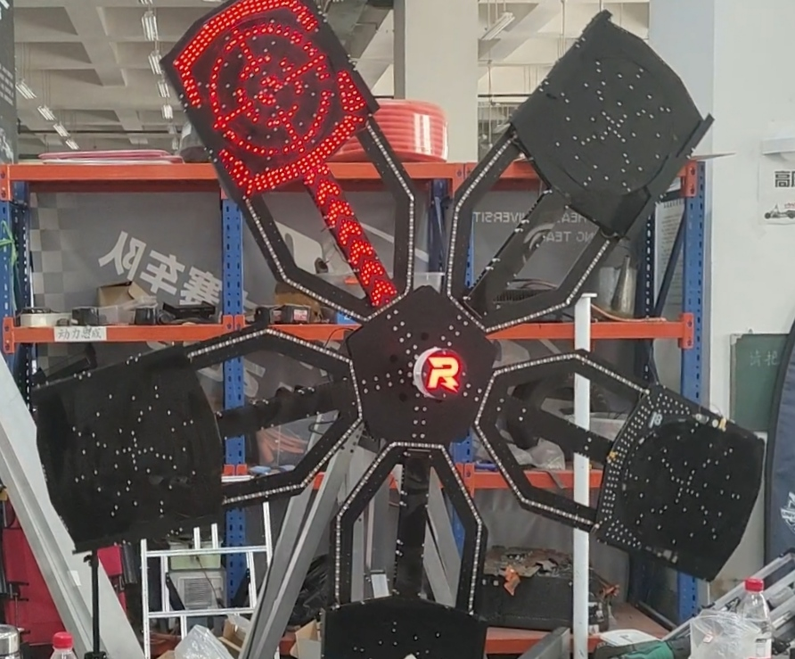
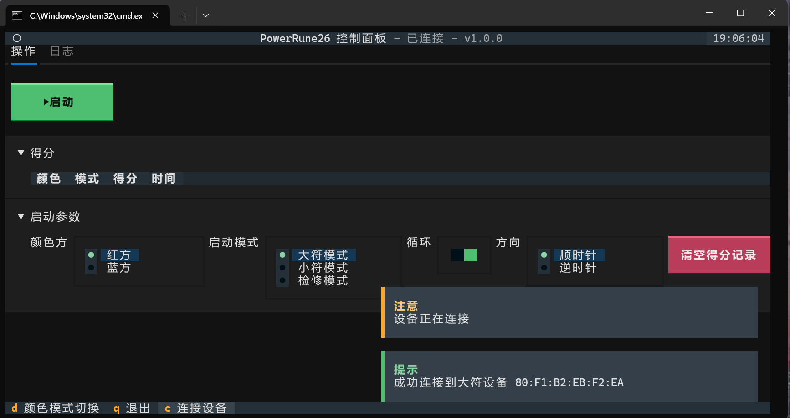
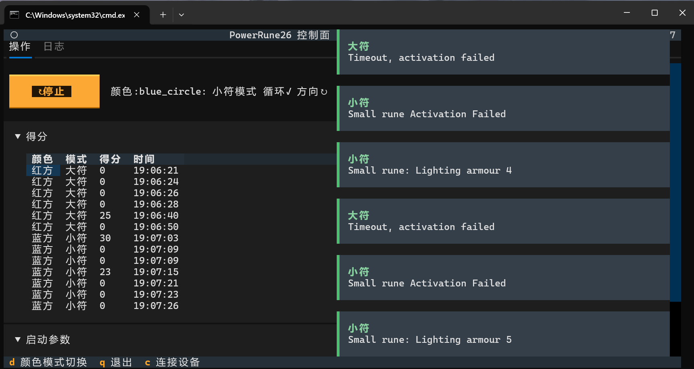
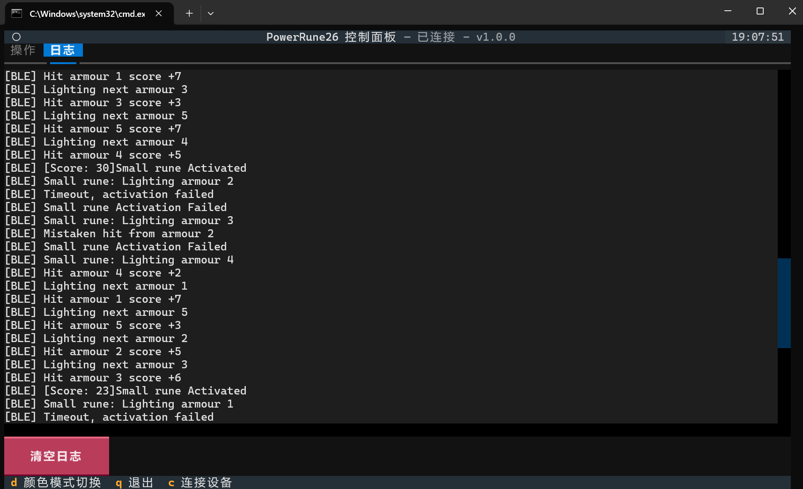
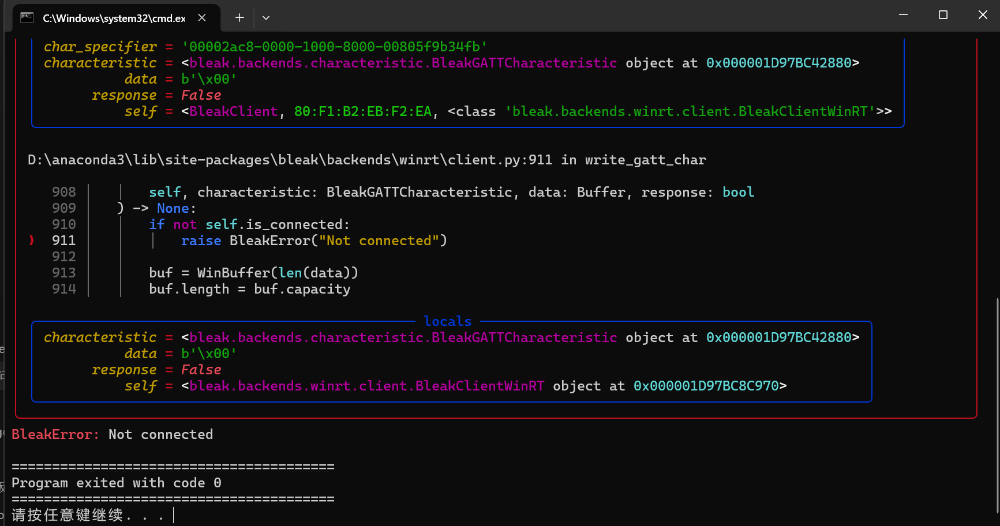

# PowerRune 26
> 无线通讯功能仅供大能量机关分布式控制使用，使用时请注意不要触犯比赛规则。移植使用时请注意通讯信道的合法性和安全性，防止干扰其他设备或者被恶意控制。


# 介绍
基于ESP-IDF的26赛季大能量机关，机关各部件之间通过无线连接，支持完整的操作模式、方向和灯效调整功能，支持蓝牙参数整定、环数成绩获取、OTA升级。

## 开源来源
本项目基于东南大学 3SE 战队的 [PowerRune24](https://github.com/ChenYuWuAi/powerrune24) 开源项目修改，适配 2026 赛季比赛规则与实际 PCB 硬件。
# 快速使用入门
## 固件烧录
### 编译环境
- ESP-IDF **v5.1.7**（已从原开源版 v4.4.8 升级）
### 工程对应关系
| 工程目录 | 烧录目标 | 芯片 |
|---|---|---|
| `powerrune-26-RLogo` | R 标主控板 | ESP32-C3 |
| `powerrune-26-Armour` | 5 块靶面板 | ESP32-S3 |
| `powerrune-26-Motor` | 电机控制板 | ESP32-C3 |
### 检修模式
- 方式一：上电后 10 秒内连击同一靶面 5 次，进入该靶面检修模式（全亮），再次连击同一靶面 5 次，退出检修模式。
- 方式二：上位机启动模式选择"检修模式"，所有靶面进入全亮检修，通过`停止`按钮退出检修模式。
- 方式三：将 `powerrune-26-Armour-Fix` 固件烧录到需检修的靶面，检修完成后重新烧录 `powerrune-26-Armour` 固件恢复正常。
### OTA
- 已默认关闭自动 OTA（`firmware.cpp` 中 `.auto_update=0`），不需要配置 WiFi `3SE-120`
- 如需启用 OTA，将 `.auto_update` 改为 1 并配置对应 WiFi

## PowerRune Operator部署
### 平台要求
- Windows或Linux
- 支持蓝牙BLE
### 环境配置
#### 1. 安装Python 3.7以上版本，并配置python、pip的环境变量。
基础操作，自行上网搜索即可。
#### 2. 执行安装脚本。
```shell
git clone https://github.com/suiyi29/PowerRune26.git
```
```shell
cd ./powerrune26/powerrune-26-Operator/
```
```shell
./install.sh
```
- Windows用户请使用`install.bat`。
- Linux用户请使用`install.sh`。
- 本脚本会自动安装所需的Textual、Bleak和Rich库。
#### 3. 运行PowerRune Operator。
- Windows用户可直接双击`启动上位机.bat`启动。
- 或手动执行：
```shell
python pr-26-operator.py
```
## 快速使用
### 1. 连接大符电源
确保大符电源已经开启。
- 将大符移动到目标位置。
- 确认大符周围净空，防止运转中干涉。
- 将大符`220V`电源插头插入电源插座。
- 确认大符电源指示灯亮起，或听到风扇正常运转声音。
- OTA 已默认关闭，如需启用请参考上方「固件烧录」章节的 OTA 说明。


上电后大符将进行初始化，完成后，大符R标将显示为待命状态，此时BLE进入可以连接状态。
### 2. 连接PowerRune Operator
- 打开PowerRune Operator。
- 软件会自动执行连接操作，连接成功后，软件会显示大符的状态信息。
- 如果连接失败，请检查大符电源是否正常，是否完成初始化，是否在可连接状态，是否正在更新。
- 如果初次连接失败，请尝试按C重新连接，或者重启大符电源。
- 如果多次连接失败，请联系技术支持。
### 3. 操作大符
- 选择相应的启动参数之后，点击`启动`按钮，大符将开始运行。

- 大符运行过程中，可以通过`停止`按钮停止大符运行。
- 大符运行时产生的环数成绩会显示在软件界面上。

- 大符运行时，可以手动观察大符的运行日志，分析击打结果。

- 若上位机出现卡退界面，点击右上角关闭即可。

### 4. OTA升级、参数整定
该部分功能未在PowerRune Operator内开放。

如有需要，请联系技术支持。

支持调整的参数包括：
- PID参数
- 靶环亮度
- 靶臂亮度
- 流水灯亮度
- R标亮度
- 开机自动OTA升级开关
- OTA Wifi配置

# 已知问题
### 0. 受设备蓝牙PHY天线发射功率、天线布置、无线环境等因素影响，部分笔记本电脑上在打符点距离上蓝牙会出现间歇性断联，请尝试更换设备或者联系技术支持使用手机手动开符。
### 1. PowerRune Operator报错。
- 请检查是否已经安装了所需的库，包括textual和bleak。
- 请尝试更换设备，因为某些系统平台(如Android)上的蓝牙驱动无法由bleak库调用。
- 尝试重启程序，因为蓝牙异常断开时没有完善断联检测，会报错。
### 2. 大符靶子工作异常，似乎某些扇叶出现了重启，击打无反应，或者靶子无法停止。
- 请不要频繁击打，因为大符击打的中断过度激活会导致靶子重启。(问题已解决)
- 靶子异常重启后，由于通信机制设置，防止数据不安全或者紊乱出现，用户需要手动切断电源，等待5秒后重新连接电源，等待靶子自动初始化。
- 请检查大符周围是否有干涉物，是否有异物进入靶子内部。
- 请检查大符电源是否正常，运行过程中是否有异常灯效、异常声音或者异常气味。如果有异常，请立即切断电源，不要重新连接电源，并立即联系技术支持。
### 3. 大符开机时有环为绿色。
- 受打击次数影响，部分键轴会不可避免地损坏，大符系统会自动检测损坏键轴并屏蔽环上的输入信号，并在开机、OTA操作时提示损坏区域。少量绿色环不会影响实际操作，但是如果绿色环面积过大，则需要维护更换键轴。
### 4. 模式切换时灯效状态残留（正在尝试解决）
- 大符切小符后，已激活过的靶面会残留大符进度条；小符切大符后，未激活过的靶面不显示进度条。
- 需进入一次正在激活状态（箭头流水灯）后才恢复正常。刚上电首次选择模式无此问题。
- 临时方案：切换模式后略过前几轮，待所有靶面均进入过一次正在激活状态后再使用。
### 5. 检修模式无法在线退出
- 进入检修模式后，需断电重启才能恢复正常模式。（问题已解决）
### 6. 蓝牙断连后上位机状态不同步（正在尝试解决）
- 大符运行中断电重启后，上位机可能仍显示连接成功，导致启动时卡退或大符不工作。
- 原因：ESP 低功耗蓝牙信号较弱，易受干扰丢包。
- 解决办法：大符重启后同步重启上位机；若已启动出现异常，重启上位机即可恢复。

# 贡献
1. 3SE 程浩 扇叶PCB&程序、R标PCB&程序、电机控制板程序、电控&通讯框架
2. 3SE 陈申 电机控制板、分电板
3. 3SE 张邦哲 BLE通讯框架
4. 3SE 郁泽智 机械设计
5. Adam 
